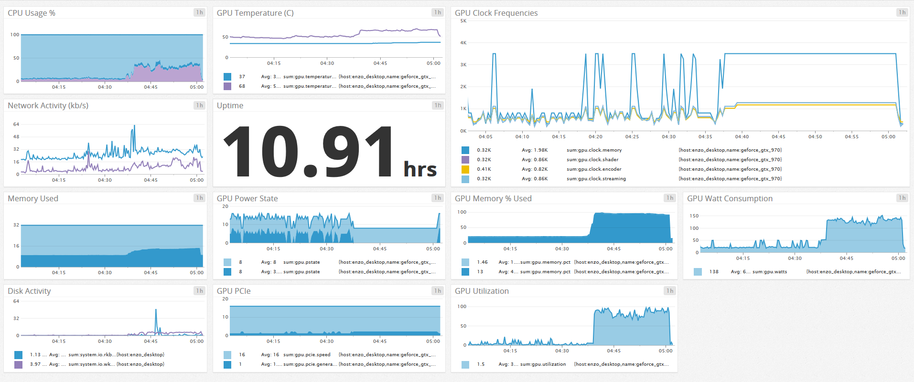

GPU Stats Report
=======================

Polls GPU information and reports it to Datadog.

Each GPU on the machine is reported separately, though not all GPUs support reporting all stats through the exposed APIs

**Only supports nVidia hardware** though feel free to make a pull-request with support for other GPU manufacturers

#####Example

##Install

* Download and install the latest [NodeJS]
* Install the [DataDog] agent
* Clone the repo
* Follow the [Node Gyp setup guide]
* Ensure `nvidia-smi`, usually located under `C:\Program Files\NVIDIA Corporation\NVSMI`, is available in your `PATH`
* Run `npm install` from the repo base directory
* Run `npm run dev`

##Usage

###Config
| Name | Default | Description |
| ------------- | ------------- |  ------------- |

Copy the example [config] file in `/config/example.local.js` to `/config/local.js` and edit the settings you wish to override

##License
See [license] file

[config]:config/example.local.js
[DataDog]:https://www.datadoghq.com/
[license]:license
[NodeJS]:https://nodejs.org/en/
[Node Gyp setup guide]:https://github.com/TooTallNate/node-gyp#installation
